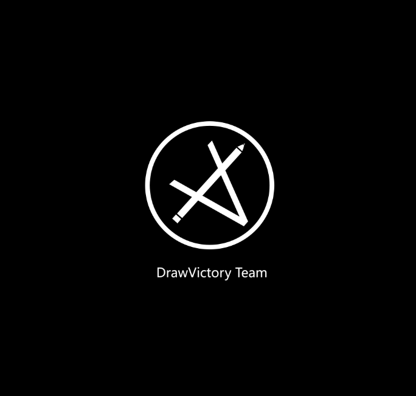

# 说明：

#### 1声明：

这个源代码是***DrawVictory Team***的官网源代码，现在市面上很少有大型网站的案例，这个网站集成了用户注册，邮箱发送，文章论坛，留言等一系列系统，帮助初学者了解大型网站的工作方式。

This source code is the official website source code of the DrawVictory Team. There are few cases of large websites on the market now. This website integrates a series of systems such as user registration, email delivery, article forum, and message to help beginners understand the working methods of large websites.

本项目调用了少数几个**开源项目**，列举如下：
**WangEditor**：[https://github.com/wangeditor-team/wangEditor](https://github.com/wangeditor-team/wangEditor)

**cropper**：[https://github.com/fengyuanchen/cropperjs](https://github.com/fengyuanchen/cropperjs)

**jQuery**：[https://github.com/jquery/jquery](https://github.com/jquery/jquery)

**PHPMailer**：[https://github.com/PHPMailer/PHPMailer](https://github.com/PHPMailer/PHPMailer)

以上项目已经都放入项目文件夹当中，文件目录如下：
**WangEditor**：web/editor

**cropper**:web/crooper

**jQuery**:web/javascript/jquery-3.5.1.min.js

**PHPMailer**：web/php/PHPMailer-master

This project calls a few open source projects, as listed below:

**WangEditor**： [https://github.com/wangeditor-team/wangEditor](https://github.com/wangeditor-team/wangEditor)

**cropper**： [https://github.com/fengyuanchen/cropperjs](https://github.com/fengyuanchen/cropperjs)

**jQuery**： [https://github.com/jquery/jquery](https://github.com/jquery/jquery)

**PHPMailer**： [https://github.com/PHPMailer/PHPMailer](https://github.com/PHPMailer/PHPMailer)

The above items have been placed in the project folder, and the file directory is as follows:

**WangEditor**：web/editor

**cropper**:web/crooper

**jQuery**:web/javascript/jquery-3.5.1.min.js

**PHPMailer**：web/php/PHPMailer-master

注意：**Github上Dinowritecode与Gitee上的DinosaurYH是同一个作者**，做的项目都由DinosaurYH（化名）在维护，两个平台上的项目并不冲突，并且这两个平台会同步更新。以下是项目地址：
Github：[https://github.com/Dinowritecode/DrawVictory-Team-s-website]([https://github.com/Dinowritecode/DrawVictory-Team-s-website]())

Gitee：[https://toscode.gitee.com/dinosuaryh/draw-victory-team-website](https://toscode.gitee.com/dinosuaryh/draw-victory-team-website)

Note: Dinowritecode on Github and DinosaurYH on Gitee are the same author. The projects are maintained by DinosaurYH (alias). The projects on the two platforms do not conflict, and the two platforms will be updated synchronously. The following is the project address:

Github：[https://github.com/Dinowritecode/DrawVictory-Team-s-website]([https://github.com/Dinowritecode/DrawVictory-Team-s-website]())

Gitee：[https://toscode.gitee.com/dinosuaryh/draw-victory-team-website](https://toscode.gitee.com/dinosuaryh/draw-victory-team-website)

**本项目允许任何人进行更改和修正，并且将其应用在自己项目上甚至进行商业化。**

**This project allows anyone to make changes and amendments, and apply them to their own projects or even commercialize them.**

#### 2.介绍

DrawVictory Team是来自中国由六个学生组建起的小型团队，团队主要面向游戏开发，动画，web等领域，团队的组建全凭我们的兴趣，请关注团队的bilibili账号，后期将会组建起官网，敬请期待。

**bilibili社交账号**：[https://space.bilibili.com/669442389](https://space.bilibili.com/669442389)

The DrawVictory Team is a small team built by six student groups from China. The team is mainly oriented to game development, animation, web and other fields. The team is built based on our interests. Please pay attention to the team's bilibilibili account. The official website will be set up later. Please look forward to it.

**Bilibili social account** :[ https://space.bilibili.com/669442389 ](https://space.bilibili.com/669442389)

#### 3.使用说明：

以下，我们将会详细讲解如何配置这些源码，了解它的运行原理，并且您将学会如何将这个项目配置到您的服务器上，做出自定义更改，并了解大型网站的功能是如何实现的，本项目使用的是**PHP，Javascript，HTML/CSS**构建的，我们尽可能将项目的运行原理与您说明白，以便您的使用和修改。

Next, we will explain in detail how to configure these source codes, understand its operating principle, and you will learn how to configure this project on your server, make customized changes, and understand how to realize the functions of large websites. This project is built using **PHP, Javascript, HTML/CSS**. We will try to explain the operating principle of the project to you for your use and modification.

（后面还没做完，敬请期待下一次更新......[]~(￣▽￣)~*）

（We haven't finished yet. Please look forward to the next update......[]~(￣▽￣)~*)
